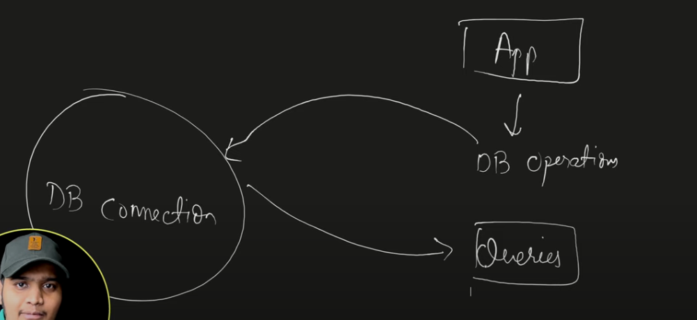
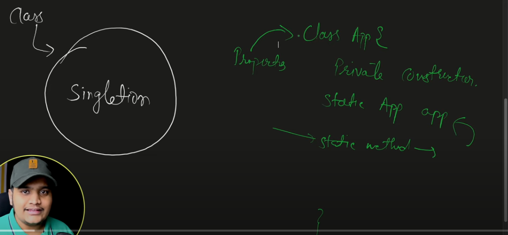
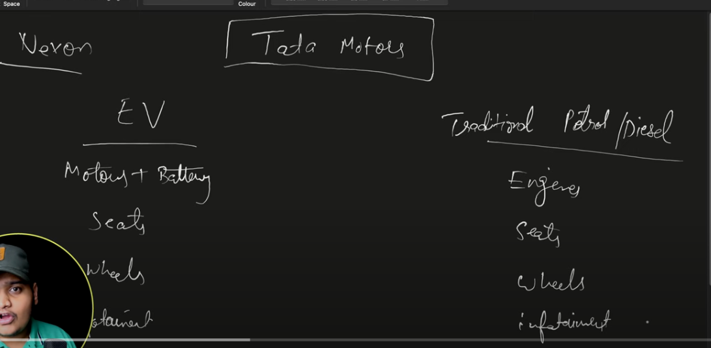
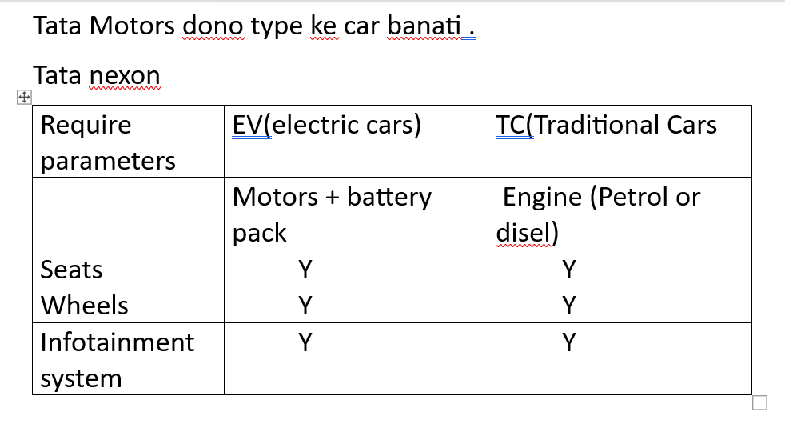
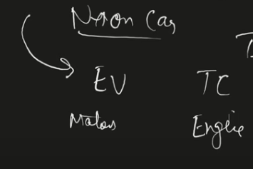
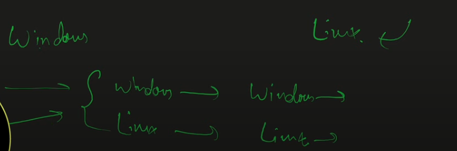

# Design Pattern
# 1. Singleton Design Pattern

## What is singleton object?

Vaise hum apne app mein kayi tarah se object create kar sakte.

In you app when you need to create your object only 1 time tab hum singleton object banate.



hum chahte hai ki hamare app mein 1 hi Db connection ka object rahe and jab bhi humko db operations karna hai to execute the queries everytime we refers to same db connection object.

Accross your application use same object.

Db connection object consist of db properties url username password etc.

## In order to make object single follow things.
1. private constructor(no one should able to create object of it.)
2. humko iska instance 1 baar banana hai.. so we should need to create static instance and with static mehtod we should create 1 time object.
3. properties should be static and directly instantiated.



## Different ways of creating singleton class and break it.

```java
package com.adi;

public class Singleton {

	//1. constructor should be private
	private Singleton() {
		
	}
	
	//2. static instance
	private static Singleton instance = null;
	
	//3. static method to fetch object
	public static Singleton getInstance() {
		
		if(instance == null) {
			instance = new Singleton();
		}
		
		return instance;
	}
}

```
jab bhi hum Singleton.getInstance() call karege ye humko 1 hi object return karenga.

### Problem here
In a multi threaded environment, jab bhi let say 2 thread approach karengi getInstance() mehtod ko toh.. dono thread ke liye 2 object create honge... violating the principle of Singleton design pattern.

```java
package com.adi;

public class EagerInitialization {

	private static final EagerInitialization instance = new EagerInitialization();
	//At that time of declartion of object instantiate it.
	// final keyword ke wajah se 1 hi baar instantiate honga.
	//so jab jvm mein class load honga at that time the object is created.
	
	private EagerInitialization() {
		
	}
	
	
	public static EagerInitialization getInstance() {
		
		return instance;
	}
	
}

```

### Problem here
yadi hum ye instance use nhi kar rahe; tabhi bhi jvm is class ka instance memory mein banake rakhenga.. so resource will be utilized faltu mein.

## Thread-safe and not using memory if not in used.
```java
package com.adi;

public class MultithreadedSingleton {
	
	private static MultithreadedSingleton instance = null;
	
	private MultithreadedSingleton() {
		
	}
	
	//synchronized method
	// only 1 thread able to call this method at a time
	//  2 or more thread will wait and get chance only after completion of 1st thread.
	public static synchronized MultithreadedSingleton  getInstance() {
		
		if(instance == null) {
			
			instance = new MultithreadedSingleton();
		}
		
		return instance;
	}
}

```
### Problem here:
Agar 100 therad hai.. to waiting time increse ho javenga..

## Instead of synchronized method use synchronized block
```java
package com.adi;

public class MultithreadedSingleton {
	
	private static MultithreadedSingleton instance = null;
	
	private MultithreadedSingleton() {
		
	}
	

	public static  MultithreadedSingleton  getInstance() {
		
		if(instance == null) {
			
			//synchronized block
			//jab object create ho raha honga.. to wo 1 hi thread se ho.. 
			// ye chaiye..and other thread just using that object.
			
			//yaha class level object locking we use
			//let say 10 therad yaha par aayi hai..
			// so sync mein 1 javengi..
			// instance null - create instnce
			// baki 9 ko instance create hua milenga..
			//  wo skip karengi banana
			synchronized (MultithreadedSingleton.class) {
				
				if(instance == null) {
					instance = new MultithreadedSingleton();
				}
			}
		}
		
		return instance;
	}
}


```

## Can we break the singleton pattern?

### via serialization
it is one of the way that will break the concept of Singleton

serialization - it will convert your object into byte form and that form will be sent over to the network.

de serialization- vice versa.
```java
package com.adi;

import java.io.Serializable;

public class LazySingleton implements Serializable{

	private static LazySingleton instance = null;
	
	private LazySingleton() {
		
	}
	
	public static LazySingleton getInstance() {
		
		if(instance == null) {
			instance = new LazySingleton();
		}
		
		return instance;
	}
}

```

```java
package com.adi;

import java.io.FileInputStream;
import java.io.FileNotFoundException;
import java.io.FileOutputStream;
import java.io.IOException;
import java.io.ObjectInputStream;
import java.io.ObjectOutputStream;

public class ExampleSerialization {

	public static void main(String[] args) throws FileNotFoundException, ClassNotFoundException, IOException {
		
		exampleSerialization();

	}

	private static void exampleSerialization() throws FileNotFoundException, IOException, ClassNotFoundException {
		
		LazySingleton lazySingleton = LazySingleton.getInstance();
		
		//serialization - writing object to stream
		//here i am storing my singleton object in object.obj
		//so my class will be saved in object.obj
		ObjectOutputStream objectOutputStream = new ObjectOutputStream(new FileOutputStream("Object.obj"));
		objectOutputStream.writeObject(lazySingleton);
		objectOutputStream.close();
		
		//de-serialization
		ObjectInputStream objectInputStream = new ObjectInputStream(new FileInputStream("object.obj"));
		LazySingleton desiralizeObj = (LazySingleton) objectInputStream.readObject();
		objectInputStream.close();
		
		
		//if serialize and deserilize object hashcode are same then
		// serialize and desirialize object are equal
		System.out.println("object 1 : "+ lazySingleton.hashCode()); //object 1 : 1335050193
		System.out.println("object 2 : "+ desiralizeObj.hashCode()); // object 2 : 517210187
		
	}

}

```

### Solve this
```java
package com.adi;

import java.io.Serializable;

public class Singleton implements Serializable {

	private Singleton() {

	}

	private static Singleton instance = null;

	public static Singleton getInstance() {

		if (instance == null) {
			instance = new Singleton();
		}

		return instance;
	}
	
	//here we use readResolve() 
	//  It will be called by jvm while doing de-serializtion
	// desiralzie mein- byte array leke convert karna object mein
	// inte  matha fodi se instance hi return karwa lo
	
	protected Object readResolve() {
		
		return instance;
	}
}

```
```java
package com.adi;

import java.io.FileInputStream;
import java.io.FileNotFoundException;
import java.io.FileOutputStream;
import java.io.IOException;
import java.io.ObjectInputStream;
import java.io.ObjectOutputStream;

public class ExampleSerialization {

	public static void main(String[] args) throws FileNotFoundException, ClassNotFoundException, IOException {
		
		exampleSerialization();

	}

	private static void exampleSerialization() throws FileNotFoundException, IOException, ClassNotFoundException {
		
		Singleton singleton = Singleton.getInstance();
		
		ObjectOutputStream objectOutputStream = new ObjectOutputStream(new FileOutputStream("Object.obj"));
		objectOutputStream.writeObject(singleton);
		objectOutputStream.close();
		
	
		ObjectInputStream objectInputStream = new ObjectInputStream(new FileInputStream("object.obj"));
		Singleton desiralizeObj = (Singleton) objectInputStream.readObject();
		objectInputStream.close();
		
		
		
		System.out.println("object 1 : "+ singleton.hashCode());  // object 1 : 1335050193
		System.out.println("object 2 : "+ desiralizeObj.hashCode()); // object 2 : 1335050193
		
		
	}

}

```

## via reflections u can break singleton design pattern
```java
package com.adi;

import java.io.Serializable;

public class LazySingleton implements Serializable{

	private static LazySingleton instance = null;
	
	private LazySingleton() {
		
	}
	
	public static LazySingleton getInstance() {
		
		if(instance == null) {
			instance = new LazySingleton();
		}
		
		return instance;
	}
}

```

```java
package com.adi;

import java.lang.reflect.Constructor;
import java.lang.reflect.InvocationTargetException;

public class ExampleSerialization {

	public static void main(String[] args) throws InstantiationException, IllegalAccessException, IllegalArgumentException, InvocationTargetException{
		
		exampleReflection();

	}

	private static void exampleReflection() throws InstantiationException, IllegalAccessException, IllegalArgumentException, InvocationTargetException {
		
		//We are getting all the declaring constructors
		Constructor[] constructors = LazySingleton.class.getDeclaredConstructors();
		
		//usme khali 1 hi constructor declared hai.. fetch karo usko
		//private hia wo..
		Constructor constructor = constructors[0];
		
		//change accesiblity from private to public
		constructor.setAccessible(true);
		
		//create a new object with constructor
		LazySingleton newInstance = (LazySingleton) constructor.newInstance();
		
		//aur hum getInstance se jo object fetch karte hai
		LazySingleton lazySingleton = LazySingleton.getInstance();
		
		System.out.println("constutor obje : "+ newInstance.hashCode()); //constutor obje : 1277181601
		System.out.println("getInstance obj : "+lazySingleton.hashCode()); //getInstance obj : 2083562754
		
		
	}

	

}

```

## For resolving this we can use the concept of enums
```java
package com.adi;

public enum EnumSingleton {

	// varialbes are static
	INSTANCE;
	
	//In enum construtor can't be call by us
	//only jvm will call constructors in enum
	//enums are threadsafe 
	//It won't break using reflection as well
	
	public void doSomething() {
		System.out.println("Cool");
	}
}

```

```java
package com.adi;

import java.lang.reflect.Constructor;
import java.lang.reflect.InvocationTargetException;

public class ExampleSerialization {

	public static void main(String[] args) throws InstantiationException, IllegalAccessException, IllegalArgumentException, InvocationTargetException{
		
		exampleReflection();

	}

	private static void exampleReflection() throws InstantiationException, IllegalAccessException, IllegalArgumentException, InvocationTargetException {
		
	
		Constructor[] constructors = LazySingleton.class.getDeclaredConstructors();
	
		Constructor constructor = constructors[0];
		
		constructor.setAccessible(true);
		
		LazySingleton newInstance = (LazySingleton) constructor.newInstance();
		
		
		LazySingleton lazySingleton = LazySingleton.getInstance();
		
		System.out.println("constutor obje : "+ newInstance.hashCode()); //constutor obje : 1277181601
		System.out.println("getInstance obj : "+lazySingleton.hashCode()); //getInstance obj : 2083562754
		
		EnumSingleton.INSTANCE.doSomething(); //Cool
		//yadi hum enum use karke instance banaye.. so reflection break nhi kar pavenga.
		
	}

	

}

```
# 2. Factory Design Pattern in details




 
 Mujko Nexon Electric car banani hia to pass EV 

 and  Nexon Tradtional car banani hai to pass TC

 Rest assembly line is same.


 So here in Factory design pattern, Based on some parameter we are going to create an object.

 We just focus on end product, and not on how it's created.

 ### Eg
 

 Suppose you are creating an app and that app runs in Windows as well as in linux Operating system.  
File sys different hai dono mein. File command dono ki diff hai.

So we create our object in such a way that if we pass windows toh window ka object banke aavenga..
Vice versa for linux

### Factory design patter ya to abstract clas ya interface se hi ban sakta.
```java
package com.adi.factory;

public abstract class OperatingSystem {

	//Os ke diff diff version hote
	private String version;
	
	//OS ke diff architecure bhi hote
	private String architecture;

	public String getVersion() {
		return version;
	}

	public void setVersion(String version) {
		this.version = version;
	}

	public String getArchitecture() {
		return architecture;
	}

	public void setArchitecture(String architecture) {
		this.architecture = architecture;
	}

	public OperatingSystem(String version, String architecture) {
		super();
		this.version = version;
		this.architecture = architecture;
	}
	
	
	// 2 abstract methods-- jiske aapko implelmentation provide karna honga..
	//This 2 methods are diff based on diff os.
	//change directory ki command badal jati linux or windows mein
	public abstract void changeDir(String dir);
	
	public abstract void removeDir(String dir);
}

```
```java
package com.adi.factory;

public class LinuxOperatingSystem extends OperatingSystem {

	
	
	public LinuxOperatingSystem(String version, String architecture) {
		super(version, architecture);		
	}

	@Override
	public void changeDir(String dir) {
		// TODO Auto-generated method stub
		
	}

	@Override
	public void removeDir(String dir) {
		// TODO Auto-generated method stub
		
	}

}

```

```java
package com.adi.factory;

public class WindowsOperatingSystem  extends OperatingSystem{

	public WindowsOperatingSystem(String version, String architecture) {
		super(version, architecture);
		// TODO Auto-generated constructor stub
	}

	@Override
	public void changeDir(String dir) {
		// TODO Auto-generated method stub
		
	}

	@Override
	public void removeDir(String dir) {
		// TODO Auto-generated method stub
		
	}

}

```

```java
package com.adi.factory;

public class OperatingSystemFactory {
	
	//Constructor private
	// no one can create instance
	// Object created in Factory premises no one have access
	
	private OperatingSystemFactory() {
		
	}
	
	public static OperatingSystem getInstance(String type, String version, String architecture) {
		switch(type) {
		case "WINDOWS":
			return new WindowsOperatingSystem(version, architecture);
		
		case "LINUX":
			return new LinuxOperatingSystem(version, architecture);
			
		default:
			throw new IllegalArgumentException("Os Not Supported");
		
		}
	}

}

```

Hum yaha OperatingSystemFactory.getInstance()
 call karke apna desired parameter i.e type  (windows or linux) pass karenge.. aur apna object use karenge.. humko koyi lena dena nhi isne object create kaise kiya..

 