# Design Pattern
# 1. Singleton Design Pattern

## What is singleton object?

Vaise hum apne app mein kayi tarah se object create kar sakte.

In you app when you need to create your object only 1 time tab hum singleton object banate.


hum chahte hai ki hamare app mein 1 hi Db connection ka object rahe and jab bhi humko db operations karna hai to execute the queries everytime we refers to same db connection object.

Accross your application use same object.

Db connection object consist of db properties url username password etc.

## In order to make object single follow things.
1. private constructor(no one should able to create object of it.)
2. humko iska instance 1 baar banana hai.. so we should need to create static instance and with static mehtod we should create 1 time object.
3. properties should be static and directly instantiated.


## Different ways of creating singleton class and break it.

```java
package com.adi;

public class Singleton {

	//1. constructor should be private
	private Singleton() {
		
	}
	
	//2. static instance
	private static Singleton instance = null;
	
	//3. static method to fetch object
	public static Singleton getInstance() {
		
		if(instance == null) {
			instance = new Singleton();
		}
		
		return instance;
	}
}

```
jab bhi hum Singleton.getInstance() call karege ye humko 1 hi object return karenga.

### Problem here
In a multi threaded environment, jab bhi let say 2 thread approach karengi getInstance() mehtod ko toh.. dono thread ke liye 2 object create honge... violating the principle of Singleton design pattern.

```java
package com.adi;

public class EagerInitialization {

	private static final EagerInitialization instance = new EagerInitialization();
	//At that time of declartion of object instantiate it.
	// final keyword ke wajah se 1 hi baar instantiate honga.
	//so jab jvm mein class load honga at that time the object is created.
	
	private EagerInitialization() {
		
	}
	
	
	public static EagerInitialization getInstance() {
		
		return instance;
	}
	
}

```

### Problem here
yadi hum ye instance use nhi kar rahe; tabhi bhi jvm is class ka instance memory mein banake rakhenga.. so resource will be utilized faltu mein.

## Thread-safe and not using memory if not in used.
```java
package com.adi;

public class MultithreadedSingleton {
	
	private static MultithreadedSingleton instance = null;
	
	private MultithreadedSingleton() {
		
	}
	
	//synchronized method
	// only 1 thread able to call this method at a time
	//  2 or more thread will wait and get chance only after completion of 1st thread.
	public static synchronized MultithreadedSingleton  getInstance() {
		
		if(instance == null) {
			
			instance = new MultithreadedSingleton();
		}
		
		return instance;
	}
}

```
### Problem here:
Agar 100 therad hai.. to waiting time increse ho javenga..

## Instead of synchronized method use synchronized block
```java
package com.adi;

public class MultithreadedSingleton {
	
	private static MultithreadedSingleton instance = null;
	
	private MultithreadedSingleton() {
		
	}
	

	public static  MultithreadedSingleton  getInstance() {
		
		if(instance == null) {
			
			//synchronized block
			//jab object create ho raha honga.. to wo 1 hi thread se ho.. 
			// ye chaiye..and other thread just using that object.
			
			//yaha class level object locking we use
			//let say 10 therad yaha par aayi hai..
			// so sync mein 1 javengi..
			// instance null - create instnce
			// baki 9 ko instance create hua milenga..
			//  wo skip karengi banana
			synchronized (MultithreadedSingleton.class) {
				
				if(instance == null) {
					instance = new MultithreadedSingleton();
				}
			}
		}
		
		return instance;
	}
}


```

## Can we break the singleton pattern?

### via serialization
it is one of the way that will break the concept of Singleton

serialization - it will convert your object into byte form and that form will be sent over to the network.

de serialization- vice versa.
```java
package com.adi;

import java.io.Serializable;

public class LazySingleton implements Serializable{

	private static LazySingleton instance = null;
	
	private LazySingleton() {
		
	}
	
	public static LazySingleton getInstance() {
		
		if(instance == null) {
			instance = new LazySingleton();
		}
		
		return instance;
	}
}

```

```java
package com.adi;

import java.io.FileInputStream;
import java.io.FileNotFoundException;
import java.io.FileOutputStream;
import java.io.IOException;
import java.io.ObjectInputStream;
import java.io.ObjectOutputStream;

public class ExampleSerialization {

	public static void main(String[] args) throws FileNotFoundException, ClassNotFoundException, IOException {
		
		exampleSerialization();

	}

	private static void exampleSerialization() throws FileNotFoundException, IOException, ClassNotFoundException {
		
		LazySingleton lazySingleton = LazySingleton.getInstance();
		
		//serialization - writing object to stream
		//here i am storing my singleton object in object.obj
		//so my class will be saved in object.obj
		ObjectOutputStream objectOutputStream = new ObjectOutputStream(new FileOutputStream("Object.obj"));
		objectOutputStream.writeObject(lazySingleton);
		objectOutputStream.close();
		
		//de-serialization
		ObjectInputStream objectInputStream = new ObjectInputStream(new FileInputStream("object.obj"));
		LazySingleton desiralizeObj = (LazySingleton) objectInputStream.readObject();
		objectInputStream.close();
		
		
		//if serialize and deserilize object hashcode are same then
		// serialize and desirialize object are equal
		System.out.println("object 1 : "+ lazySingleton.hashCode()); //object 1 : 1335050193
		System.out.println("object 2 : "+ desiralizeObj.hashCode()); // object 2 : 517210187
		
	}

}

```

### Solve this
```java
package com.adi;

import java.io.Serializable;

public class Singleton implements Serializable {

	private Singleton() {

	}

	private static Singleton instance = null;

	public static Singleton getInstance() {

		if (instance == null) {
			instance = new Singleton();
		}

		return instance;
	}
	
	//here we use readResolve() 
	//  It will be called by jvm while doing de-serializtion
	// desiralzie mein- byte array leke convert karna object mein
	// inte  matha fodi se instance hi return karwa lo
	
	protected Object readResolve() {
		
		return instance;
	}
}

```
```java
package com.adi;

import java.io.FileInputStream;
import java.io.FileNotFoundException;
import java.io.FileOutputStream;
import java.io.IOException;
import java.io.ObjectInputStream;
import java.io.ObjectOutputStream;

public class ExampleSerialization {

	public static void main(String[] args) throws FileNotFoundException, ClassNotFoundException, IOException {
		
		exampleSerialization();

	}

	private static void exampleSerialization() throws FileNotFoundException, IOException, ClassNotFoundException {
		
		Singleton singleton = Singleton.getInstance();
		
		ObjectOutputStream objectOutputStream = new ObjectOutputStream(new FileOutputStream("Object.obj"));
		objectOutputStream.writeObject(singleton);
		objectOutputStream.close();
		
	
		ObjectInputStream objectInputStream = new ObjectInputStream(new FileInputStream("object.obj"));
		Singleton desiralizeObj = (Singleton) objectInputStream.readObject();
		objectInputStream.close();
		
		
		
		System.out.println("object 1 : "+ singleton.hashCode());  // object 1 : 1335050193
		System.out.println("object 2 : "+ desiralizeObj.hashCode()); // object 2 : 1335050193
		
		
	}

}

```

## via reflections u can break singleton design pattern
```java
package com.adi;

import java.io.Serializable;

public class LazySingleton implements Serializable{

	private static LazySingleton instance = null;
	
	private LazySingleton() {
		
	}
	
	public static LazySingleton getInstance() {
		
		if(instance == null) {
			instance = new LazySingleton();
		}
		
		return instance;
	}
}

```

```java
package com.adi;

import java.lang.reflect.Constructor;
import java.lang.reflect.InvocationTargetException;

public class ExampleSerialization {

	public static void main(String[] args) throws InstantiationException, IllegalAccessException, IllegalArgumentException, InvocationTargetException{
		
		exampleReflection();

	}

	private static void exampleReflection() throws InstantiationException, IllegalAccessException, IllegalArgumentException, InvocationTargetException {
		
		//We are getting all the declaring constructors
		Constructor[] constructors = LazySingleton.class.getDeclaredConstructors();
		
		//usme khali 1 hi constructor declared hai.. fetch karo usko
		//private hia wo..
		Constructor constructor = constructors[0];
		
		//change accesiblity from private to public
		constructor.setAccessible(true);
		
		//create a new object with constructor
		LazySingleton newInstance = (LazySingleton) constructor.newInstance();
		
		//aur hum getInstance se jo object fetch karte hai
		LazySingleton lazySingleton = LazySingleton.getInstance();
		
		System.out.println("constutor obje : "+ newInstance.hashCode()); //constutor obje : 1277181601
		System.out.println("getInstance obj : "+lazySingleton.hashCode()); //getInstance obj : 2083562754
		
		
	}

	

}

```

## For resolving this we can use the concept of enums
```java
package com.adi;

public enum EnumSingleton {

	// varialbes are static
	INSTANCE;
	
	//In enum construtor can't be call by us
	//only jvm will call constructors in enum
	//enums are threadsafe 
	//It won't break using reflection as well
	
	public void doSomething() {
		System.out.println("Cool");
	}
}

```

```java
package com.adi;

import java.lang.reflect.Constructor;
import java.lang.reflect.InvocationTargetException;

public class ExampleSerialization {

	public static void main(String[] args) throws InstantiationException, IllegalAccessException, IllegalArgumentException, InvocationTargetException{
		
		exampleReflection();

	}

	private static void exampleReflection() throws InstantiationException, IllegalAccessException, IllegalArgumentException, InvocationTargetException {
		
	
		Constructor[] constructors = LazySingleton.class.getDeclaredConstructors();
	
		Constructor constructor = constructors[0];
		
		constructor.setAccessible(true);
		
		LazySingleton newInstance = (LazySingleton) constructor.newInstance();
		
		
		LazySingleton lazySingleton = LazySingleton.getInstance();
		
		System.out.println("constutor obje : "+ newInstance.hashCode()); //constutor obje : 1277181601
		System.out.println("getInstance obj : "+lazySingleton.hashCode()); //getInstance obj : 2083562754
		
		EnumSingleton.INSTANCE.doSomething(); //Cool
		//yadi hum enum use karke instance banaye.. so reflection break nhi kar pavenga.
		
	}

	

}

```
# 2. Factory Design Pattern in details


 
 Mujko Nexon Electric car banani hia to pass EV 

 and  Nexon Tradtional car banani hai to pass TC

 Rest assembly line is same.


 So here in Factory design pattern, Based on some parameter we are going to create an object.

 We just focus on end product, and not on how it's created.

 ### Eg
 

 Suppose you are creating an app and that app runs in Windows as well as in linux Operating system.  
File sys different hai dono mein. File command dono ki diff hai.

So we create our object in such a way that if we pass windows toh window ka object banke aavenga..
Vice versa for linux

### Factory design patter ya to abstract clas ya interface se hi ban sakta.
```java
package com.adi.factory;

public abstract class OperatingSystem {

	//Os ke diff diff version hote
	private String version;
	
	//OS ke diff architecure bhi hote
	private String architecture;

	public String getVersion() {
		return version;
	}

	public void setVersion(String version) {
		this.version = version;
	}

	public String getArchitecture() {
		return architecture;
	}

	public void setArchitecture(String architecture) {
		this.architecture = architecture;
	}

	public OperatingSystem(String version, String architecture) {
		super();
		this.version = version;
		this.architecture = architecture;
	}
	
	
	// 2 abstract methods-- jiske aapko implelmentation provide karna honga..
	//This 2 methods are diff based on diff os.
	//change directory ki command badal jati linux or windows mein
	public abstract void changeDir(String dir);
	
	public abstract void removeDir(String dir);
}

```
```java
package com.adi.factory;

public class LinuxOperatingSystem extends OperatingSystem {

	
	
	public LinuxOperatingSystem(String version, String architecture) {
		super(version, architecture);		
	}

	@Override
	public void changeDir(String dir) {
		// TODO Auto-generated method stub
		
	}

	@Override
	public void removeDir(String dir) {
		// TODO Auto-generated method stub
		
	}

}

```

```java
package com.adi.factory;

public class WindowsOperatingSystem  extends OperatingSystem{

	public WindowsOperatingSystem(String version, String architecture) {
		super(version, architecture);
		// TODO Auto-generated constructor stub
	}

	@Override
	public void changeDir(String dir) {
		// TODO Auto-generated method stub
		
	}

	@Override
	public void removeDir(String dir) {
		// TODO Auto-generated method stub
		
	}

}

```

```java
package com.adi.factory;

public class OperatingSystemFactory {
	
	//Constructor private
	// no one can create instance
	// Object created in Factory premises no one have access
	
	private OperatingSystemFactory() {
		
	}
	
	public static OperatingSystem getInstance(String type, String version, String architecture) {
		switch(type) {
		case "WINDOWS":
			return new WindowsOperatingSystem(version, architecture);
		
		case "LINUX":
			return new LinuxOperatingSystem(version, architecture);
			
		default:
			throw new IllegalArgumentException("Os Not Supported");
		
		}
	}

}

```

Hum yaha OperatingSystemFactory.getInstance()
 call karke apna desired parameter i.e type  (windows or linux) pass karenge.. aur apna object use karenge.. humko koyi lena dena nhi isne object create kaise kiya..

 # 3. Abstract factory design pattern.
 Factory design pattern :  Based on some specific parameter we are going to create an object.

Abstract design pattern is a factory of the factory design pattern.

I want to create the application.  
This application can be a Windows App 
& it can also be the Mac App,  
Also it contain UI logic like Button, CheckBox etc


Both Os are different and based on that they have diff UI component.

so for Window Os all UI components should be windows based
similary vice  versa for Mac.


Upar hum Application ko sirf batayenge ki humko konsi UI Factory ka app hona(window or mac) baki kuch bhi details provide karne ki jarurat nhi.

### lets create Button
```java
package com.adi.abstractFactory;

public interface Button {

	//methods of interface are by default public and abstract
	void paint();
}

```
### Window's based button
```java
package com.adi.abstractFactory.os.win;

import com.adi.abstractFactory.Button;

public class WinButton  implements Button{

	@Override
	public void paint() {
		
		System.out.println("Win Button");
		
	}

}

```
### Mac based Button
```java
package com.adi.abstractFactory.os.mac;

import com.adi.abstractFactory.Button;

public class MacButton implements Button{

	@Override
	public void paint() {
		System.out.println("Mac Button");
		
	}

}

```

### let's create checkbox
```java
package com.adi.abstractFactory;

public interface CheckBox {
	
	
	void paint();
}

```
### Windows based checkbox
```java
package com.adi.abstractFactory.os.win;

import com.adi.abstractFactory.CheckBox;

public class WinCheckBox implements CheckBox{

	@Override
	public void paint() {
		System.out.println("Windows CheckBox");
		
	}

}

```
### Mac based checkbox
```java
package com.adi.abstractFactory.os.mac;

import com.adi.abstractFactory.CheckBox;

public class MacCheckBox implements CheckBox {

	@Override
	public void paint() {
		System.out.println("Mac CheckBox");

	}

}

```

## Let's create UIFactory which are responsible for create UIcompnents
```java
package com.adi.abstractFactory;

public interface UIFactory {

	//createButton() here it is abstract method which return Button
	Button createButton();
	
	CheckBox createCheckBox();
}

```

### Windows based UIFactory responsible for creating window based UI component
```java
package com.adi.abstractFactory;

import com.adi.abstractFactory.os.win.WinButton;
import com.adi.abstractFactory.os.win.WinCheckBox;

public class WinUIFactory implements UIFactory {

	@Override
	public Button createButton() {
		
		return new WinButton();
	}

	@Override
	public CheckBox createCheckBox() {
		
		return new WinCheckBox();
	}

}

```
### Mac based UIFactory responsible for creating Mac based UI component

```java
package com.adi.abstractFactory;

import com.adi.abstractFactory.os.mac.MacButton;
import com.adi.abstractFactory.os.mac.MacCheckBox;

public class MacUIFactory implements UIFactory {

	@Override
	public Button createButton() {
		
		return new MacButton();
	}

	@Override
	public CheckBox createCheckBox() {
		
		return new MacCheckBox();
	}

}

```

### Now create Abstract Application Factory jisko UIFactory diya ..wo crate karke denga
```java
package com.adi.abstractFactory;

public class Application {

	//all our application contain button and checkBox
	private Button button;
	
	private CheckBox checkbox;
	
	public Application(UIFactory factory) {
        //initiialzie button and checkbox 
        //via provided factory
		button = factory.createButton();
		checkbox = factory.createCheckBox();
	}
	
	public void paint() {
        //once initialization done.. 
        // go use it.
		button.paint();
		checkbox.paint();
	}
}

```

```java
package com.adi.abstractFactory;

public class Main {

	public static void main(String[] args) {
	
		Application application = new Application(new WinUIFactory());
		
		application.paint();//Win Button  Windows CheckBox

		Application application2 = new Application(new MacUIFactory());
		
		application2.paint();//Mac Button  Mac CheckBox
		

	}

}

```
# 4. Builder design pattern

Whenever you want to create complex object step by step at that time us builder design pattern.  
Part of Creational design pattern.


normal house  
house with swimming pool  
house with 2 parking


Isko implement karna hia code mein.. so  need to create multiple construtor.


multiple constructor wala approach thik nhi  

hum kya karenge.. sari properties likhene.. aur builder class mein pass karenge..  uski responsibility customized object creation ki..  

builder class is inner class . 


mujhe ghar mein kya kya chaiye ye Housebuildr class mein set karngge and ant mein build() method call kar lenge..  

build() mehtod jo kuch varible set kiya hia HouseBuilder class mein uske hisab se House banake de dengi..

WE given opiton to client whatever fetaure you want you add and based on that will create product for you.

### Validation hickup

kal sala client bina kuch add kiye build() method chala denga... aur bolenga house ka object de.. So here you add validation that some basic property you need to select.


--- 
Burger example
```java
package com.adi.builder.design;

public class Burger {

	//This are the properties on top of that...
	// user can create his own burger
	
	private String size;
	private boolean egg;
	private boolean extraCheese;
	private boolean mayonese;
	private boolean onion;
	private boolean lettuce;
	
    //yaha hum customer ke hisab se constructor nhi banayenge.
	//Yaha hum multiple constructor nhi likhnege

    //hum customer ki demand burgerbuilder ko denge
    // wo hmko object banake denga..

	//  so Burger constructor ko private karenge.
	// internally call BurgerBuilder
	//  BurgerBuilder will be inner class
	//   BurgerBuilder mein hum sari property set karenge and based on that
	//    ye custom burger object banane ke de denga
	
	private Burger(BurgerBuilder burgerBuilder) {
		
		//Initialize all the fields and do the validations
		//  you can check if some property is not there you can throw exception.
		
		// burgerBuilder object banne ke baad
		
		//yaha burgerbuilder ke object se validation kar sakte..
		// phir hum Burger ki property set karke..burger return karenge

	}

	public String getSize() {
		return size;
	}

	public boolean isEgg() {
		return egg;
	}

	public boolean isExtraCheese() {
		return extraCheese;
	}

	public boolean isMayonese() {
		return mayonese;
	}

	public boolean isOnion() {
		return onion;
	}

	public boolean isLettuce() {
		return lettuce;
	}
	
   

	//inner class 
	public static class BurgerBuilder{
		
		// we address the same property here
		
		private String size;
		private boolean egg;
		private boolean extraCheese;
		private boolean mayonese;
		private boolean onion;
		private boolean lettuce;
		
		
		// to set this property 
		//   we use method jo return karengi BurgerBuilder itself
		
		public BurgerBuilder size(String size) {
			this.size = size;
			return this;
		}
		
		public BurgerBuilder egg(boolean egg) {
			this.egg = egg;
			return this;
		}
		
		public BurgerBuilder extraCheese(boolean extraCheese) {
			this.extraCheese = extraCheese;
			return this;
		}
		
		public BurgerBuilder mayonese(boolean mayonese) {
			this.mayonese = mayonese;
			return this;
		}
		
		public BurgerBuilder onion(boolean onion) {
			this.onion = onion;
			return this;
		}
		
		public BurgerBuilder lettuce(boolean lettuce) {
			this.lettuce = lettuce;
			return this;
		}
		
		//sab set hone ke baad we have build() 
		//  it will create object for us
		
		public Burger build() {
			
			//yaha this represent burger builder object
			
			return new Burger(this);
		}
	}
	
}

```

```java
package com.adi.builder.design;

public class BurgerMain {

	public static void main(String[] args) {
		
		Burger burger = new Burger.BurgerBuilder()
									.size("Large")
									.egg(true)
									.extraCheese(true)
									.mayonese(false)
									.onion(true)
									.lettuce(true)
									.build();	

       

	}

}

```

### apna yogdaan
```java
package com.adi.builder.design;

public class Burger {

	private String size;
	private boolean egg;
	private boolean extraCheese;
	private boolean mayonese;
	private boolean onion;
	private boolean lettuce;
	
	
	private Burger(BurgerBuilder burgerBuilder) {
		
		size = burgerBuilder.size;
		egg = burgerBuilder.egg;
		extraCheese = burgerBuilder.extraCheese;
		mayonese = burgerBuilder.mayonese;
		onion = burgerBuilder.onion;
		lettuce = burgerBuilder.lettuce;
	}

	public String getSize() {
		return size;
	}

	public boolean isEgg() {
		return egg;
	}

	public boolean isExtraCheese() {
		return extraCheese;
	}

	public boolean isMayonese() {
		return mayonese;
	}

	public boolean isOnion() {
		return onion;
	}

	public boolean isLettuce() {
		return lettuce;
	}
	
	@Override
	public String toString() {
		return "Burger [size=" + size + ", egg=" + egg + ", extraCheese=" + extraCheese + ", mayonese=" + mayonese
				+ ", onion=" + onion + ", lettuce=" + lettuce + "]";
	}
	
	
	public static class BurgerBuilder{		
		
		private String size;
		private boolean egg;
		private boolean extraCheese;
		private boolean mayonese;
		private boolean onion;
		private boolean lettuce;		
		
		public BurgerBuilder size(String size) {
			this.size = size;
			return this;
		}
		
		public BurgerBuilder egg(boolean egg) {
			this.egg = egg;
			return this;
		}
		
		public BurgerBuilder extraCheese(boolean extraCheese) {
			this.extraCheese = extraCheese;
			return this;
		}
		
		public BurgerBuilder mayonese(boolean mayonese) {
			this.mayonese = mayonese;
			return this;
		}
		
		public BurgerBuilder onion(boolean onion) {
			this.onion = onion;
			return this;
		}
		
		public BurgerBuilder lettuce(boolean lettuce) {
			this.lettuce = lettuce;
			return this;
		}
		
		
		public Burger build() {
			
			return   new Burger(this);
		}
	}

	
	
}

```

```java
package com.adi.builder.design;

import com.adi.builder.design.Burger.BurgerBuilder;

public class BurgerMain {

	public static void main(String[] args) {
		
		Burger burger = new Burger.BurgerBuilder()
									.size("Large")
									.egg(true)
									.extraCheese(true)
									.mayonese(false)
									.onion(true)
									.lettuce(true)
									.build();	
		
	System.out.println(burger);	
	//Burger [size=Large, egg=true, extraCheese=true, mayonese=false, onion=true, lettuce=true]
	
	Burger burger2 = new Burger.BurgerBuilder()
			.size("Large")			
			.onion(true)
			.lettuce(true)
			.build();
	
	System.out.println(burger2);
	//Burger [size=Large, egg=false, extraCheese=false, mayonese=false, onion=true, lettuce=true]

	}

}

```
### In Gangs of 4 design pattern in builder design patter director is mention ..

For Meal we have MealBuilder where we create an object and meal should be veg or non veg


VegBuilder meal create veg  and vice versa for NonVeg

Director ko bolenge.. required VegMeal wo veg denga vice versa

## Understand Director:
Simple Meal object contain getter nd Setters.
```java
package com.adi.builder.design;

public class Meal {
	
	private String curry;
	private String bread;
	private String coldDrink;
	private String biryani;
	public String getCurry() {
		return curry;
	}
	public void setCurry(String curry) {
		this.curry = curry;
	}
	public String getBread() {
		return bread;
	}
	public void setBread(String bread) {
		this.bread = bread;
	}
	public String getColdDrink() {
		return coldDrink;
	}
	public void setColdDrink(String coldDrink) {
		this.coldDrink = coldDrink;
	}
	public String getBiryani() {
		return biryani;
	}
	public void setBiryani(String biryani) {
		this.biryani = biryani;
	}
	@Override
	public String toString() {
		return "Meal [curry=" + curry + ", bread=" + bread + ", coldDrink=" + coldDrink + ", biryani=" + biryani + "]";
	}

	
}

```

Meal ka bhi ek builder rahenga jisse hum uska object create karenge.  

Since kisko bread aur curry chaihye… kisko uske sath coldDrink kaha se consturor likhte baithe..

Par ha.. Meal Veg bhi hota hai aur non veg bhi

So MealBuilder ye ek abstract class rahenga.   
	Jiske pass abstract method rahengi..  
	User add kar sake  what he want and build () kar

```java
package com.adi.builder.design;

public abstract class MealBuilder {

	//Contents that user want
	
	public abstract void addCurry();
	
	public abstract void addBread();
	
	public abstract void addColdDrink();
	
	
	public abstract void addBiryani();
	
	//method which return meal
	public abstract Meal build();
}

```

```java
package com.adi.builder.design;

public class VegMealBuilder extends MealBuilder {

	private Meal meal;
	
	
	//For VegMealBuilder we have to return meal at the end
	// so create Meal object and intialize it in constructor
	public VegMealBuilder() {
		
		meal = new Meal();
	}


	//meal mein set karte hue build() mein meal bhejlo
	@Override
	public void addCurry() {
		
		this.meal.setCurry("Veg Curry");
		
	}


	@Override
	public void addBread() {
		
		this.meal.setBread("Naan");
		
	}


	@Override
	public void addColdDrink() {
		
		this.meal.setColdDrink("sprite");
		
	}


	@Override
	public void addBiryani() {
		
		this.meal.setBiryani("Veg Biryani");
		
	}


	@Override
	public Meal build() {
		
		return meal;
	}

	

}

```
```java
package com.adi.builder.design;

public class NonVegMealBuilder extends MealBuilder{

	private Meal meal;

	public NonVegMealBuilder() {
		
		meal = new Meal();
	}

	@Override
	public void addCurry() {
		
		this.meal.setCurry("Non Veg Curry");
		
	}

	@Override
	public void addBread() {
		
		this.meal.setBread("Paratha");
		
	}

	@Override
	public void addColdDrink() {
		this.meal.setColdDrink("Thumps UP");
		
	}

	@Override
	public void addBiryani() {
		this.meal.setBiryani("Chicken Biryani");
		
	}

	@Override
	public Meal build() {
		
		return meal;
	}

	
}

```

Ab yadi kisi customer ne bola ki mereko Veg meal hona.. toh mera pass aisa kuch hona..  
Jo veg meal serve kare.. bina bole   
Ye kaam director Karenga.. (input ke hisab se—object create karke bhejenga)

```java
package com.adi.builder.design;

public class MealDirector {
	
	private MealBuilder mealBuilder;

	//MealDirector having MealBuilder in constructor 
	// which taken care what of meal is generate...
	//Veg meal builder diya director ko to
	// wo prepareMeal() ki sahayata se.. veg thali denga.
	//same case for NonVegMealBuilder direcotr diya to
	public MealDirector(MealBuilder mealBuilder) {
	
		this.mealBuilder = mealBuilder;
	}
	
	//prepareMeal() calling all the method of MealBuilder
	// and at last calling build() to retrun Meal object.
	public Meal prepareMeal() {
		mealBuilder.addBiryani();
		mealBuilder.addCurry();
		mealBuilder.addBread();
		mealBuilder.addColdDrink();
		
		return mealBuilder.build();
	}
}

```

```java
package com.adi.builder.design;

public class MainMeal {

	public static void main(String[] args) {
		
		Meal meal = new MealDirector(new VegMealBuilder()).prepareMeal();
		
		System.out.println(meal); 
		//Meal [curry=Veg Curry, bread=Naan, coldDrink=sprite, biryani=Veg Biryani]
		
		meal = new MealDirector(new NonVegMealBuilder()).prepareMeal();
		
		System.out.println(meal); 
		//Meal [curry=Non Veg Curry, bread=Paratha, coldDrink=Thumps UP, biryani=Chicken Biryani]
	}

}

```

Nested class ke pattern mein banate hia builder design Pattern follow karke so aur jabardust banta.  

Lombok mein annotation hai @Builder  yadi kiske class k upar lagaya to wo convert ho jata builder design pattern men

# 5. Prototype Design Pattern

Prototype design pattern is a Creational Design pattern.

It is helpful when we want to create a differnt type of object.


Robot example.  

P1(Base Object)  
via P1+modification  = P2 is created  
P3 is creted from P1 or P2  

So here Based on Base structure different object are created.


### When we use Prototype design pattern -> when the object creation is bulky/heavy.

So what we do instead of creating a new object everytime,  
we clone base object + do some modification  and create some new prototype object.


Vechile ye base object hai contain Engine,Model,Price  
Two Wheeler - Base + isElectric  
Four Wheeler - Base + ac + Petrol etc.

Humko Aage Two Wheeler ya FourWheeler ke prototype banana hai.    
Humko pata hai ki filhal Two Wheeler aur Four Wheeler banane mein kitna samay laga...  

### What we do?
We store Two Wheeler and Four Wheeler object in VechileRegistory in the form of Key-value pair i.e Hashmap.  

If some one want to crete Prototype of TwoWheeler he asked registry, where we return already clone of TwoWheeler object.


```java
package com.adi.prototype;

//Base class rahenga --
// isko hi hum use karke i.e(clone + modification) naya prototype create
// karenge
// so make sure this implements Cloneable (I)
public abstract class Vechile implements Cloneable {

	private String engine;
	private String model;
	private long price;
	
	public Vechile(String engine, String model, long price) {
		super();
		this.engine = engine;
		this.model = model;
		this.price = price;
	}

	public String getEngine() {
		return engine;
	}

	public void setEngine(String engine) {
		this.engine = engine;
	}

	public String getModel() {
		return model;
	}

	public void setModel(String model) {
		this.model = model;
	}

	public long getPrice() {
		return price;
	}

	public void setPrice(long price) {
		this.price = price;
	}

	//If you implement cloable(I) must override clone()
//	@Override
//	protected Object clone() throws CloneNotSupportedException {
//		
//		return super.clone();
//	}
	
	//This clone() method returning the Vechile Object
	@Override
	protected Vechile clone() throws CloneNotSupportedException {
		
		return (Vechile) super.clone();
	}

	@Override
	public String toString() {
		return "Vechile [engine=" + engine + ", model=" + model + ", price=" + price + "]";
	}
	
	
}

```

```java
package com.adi.prototype;

public class TwoWheelerVechile extends Vechile {

	//Additional property 
	private boolean isElectric;
	
	
	public TwoWheelerVechile(String engine, String model, 
								long price,boolean isElectric) {
		super(engine, model, price);
		this.isElectric = isElectric;
	}


	//Override clone method
	@Override
	protected TwoWheelerVechile clone() throws CloneNotSupportedException {
		
		return (TwoWheelerVechile) super.clone();
	}

	
}

```
```java
package com.adi.prototype;

public class FourWhellerVechile extends Vechile {

	private boolean automatic;
	private boolean isDisel;
	
	public FourWhellerVechile(String engine, String model, long price,
			              boolean automatic, boolean isDisel) {
		super(engine, model, price);
		this.automatic = automatic;
		this.isDisel = isDisel;
		
	}

	@Override
	protected FourWhellerVechile clone() throws CloneNotSupportedException {
		
		return (FourWhellerVechile) super.clone();
	}
	
	

}

```
```java
package com.adi.prototype;

import java.util.HashMap;
import java.util.Map;

public class VechileRegistry {

	//contian Hashmap
	private static Map<String, Vechile> mapVechiles = new HashMap<>();
	
	//Witin Starting of application
	//  i am creating the prototypes and storing in my registry
	static {
		mapVechiles.put("TWO", new TwoWheelerVechile("320cc", "ROYAL ENF", 250000L,false));
		mapVechiles.put("FOUR", new FourWhellerVechile("1000cc", "BMW", 1000000L, true, false));
		
	}
	
	//When my application start i have my prototype objects are ready.
	public Vechile getVechile(String vechile) throws CloneNotSupportedException
	{
		//we get object from registry
		// clone it
		// and return it
		return mapVechiles.get(vechile).clone();
	}
	
}

```
```java
package com.adi.prototype;

public class Main {

	public static void main(String[] args) throws CloneNotSupportedException {
		
		VechileRegistry registry = new VechileRegistry();
		
		System.out.println(registry.getVechile("TWO"));
		//Vechile [engine=320cc, model=ROYAL ENF, price=250000]
		
		System.out.println(registry.getVechile("FOUR"));
		//Vechile [engine=1000cc, model=BMW, price=1000000]
	}

}

```

### Basic Idea
whatever base object you create that should be supported to Clonebale(I) so that cloning operation  easily perfrom.

For sub-classes same principle applicable

After that create Registry where you create an object and store them. 

When some one require them he can call Registry method.
The method will return cloning object. 

This approach is used when the object creation is very bulky.

# 6. Adapter design pattern

It is a Structural design pattern.

It is basically adapt to diff types of objects (ie. diff type of implementations) that we have.

### Kab use karna..
Jab diff type of implementation / interface humko adapt karna hia tab.

India aur Us mein diff types of charging ports(i.e electrical sockets) so we require adapater to meet out our desire requirements.

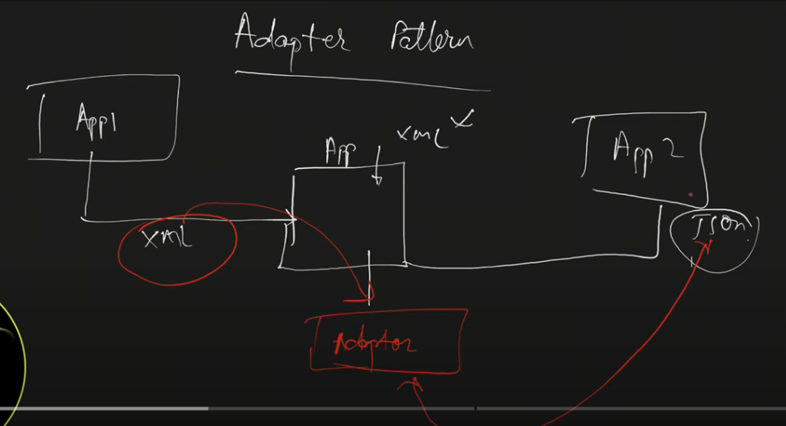

Aap kayi sari 3rd party application ke sath kam karte hai.   
Aap App1 se xml mein data lete hai..uske sath achee se kam karte hai..   
Aapko App2 ko data send karna hai App1 ka but App2 sirf json data ke sath hi kaam kar sakta..    
so aap Adapter use karonge jo xml data lenga as input aur usse json convert karke aage bhejenga.  
This is the use case of Adapter design pattern.

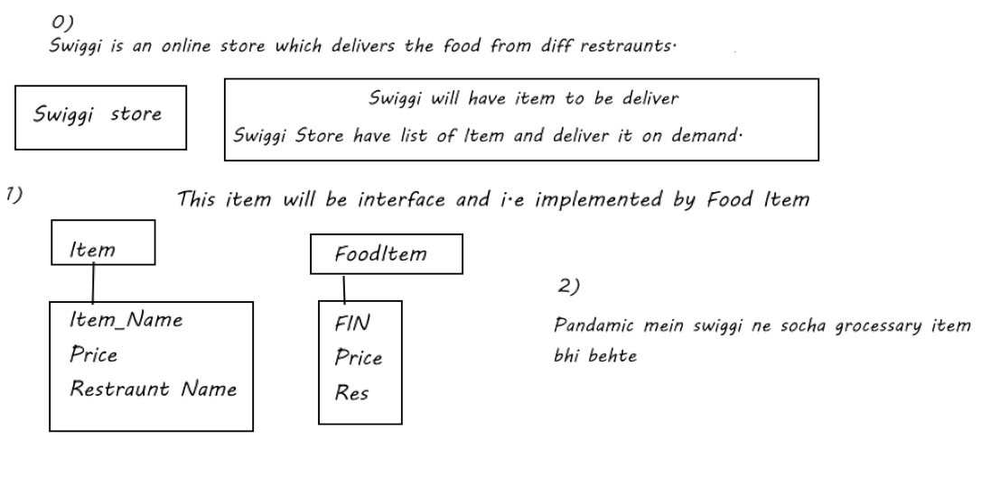

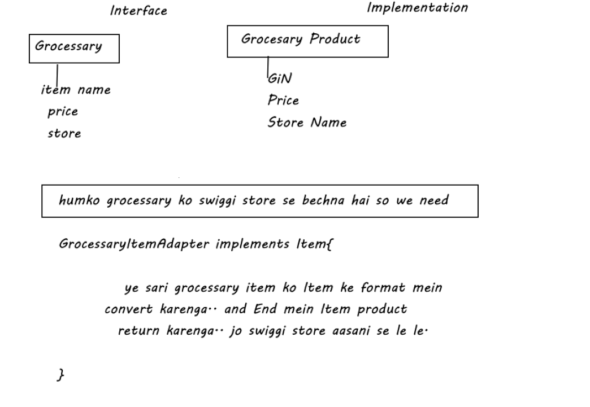

Kis tarha se call kiya jata hia.. ye yaha batayenga

### Item iterface
```java
package com.adi.adapter.designPattern;

public interface Item {

	String getItemName();
	
	String getPrice();
	
	String getRestrauntName();
}
```
### Implementation class
```java
package com.adi.adapter.designPattern;

public class FoodItem implements Item {

	@Override
	public String getItemName() {
		
		return null;
	}

	@Override
	public String getPrice() {
		
		return null;
	}

	@Override
	public String getRestrauntName() {
		
		return null;
	}

}
```
### Grocessary Interface
```java
package com.adi.adapter.designPattern;

public interface GrocessaryItem {

	String getName();
	
	String getPrice();
	
	String getStoreName();
}
```
### GrocessaryItem Implementation class
```java
package com.adi.adapter.designPattern;

public class GrocessaryProduct implements GrocessaryItem{

	@Override
	public String getName() {
		
		return null;
	}

	@Override
	public String getPrice() {
	
		return null;
	}

	@Override
	public String getStoreName() {
		
		return null;
	}	
}
```

### Swiggi Store class whcih accept items
```java
package com.adi.adapter.designPattern;

import java.util.ArrayList;
import java.util.List;

public class SwiggiStore {

	//Contain List of Items
	List<Item> items = new ArrayList<>();
	
	
	//having an add() method
	public void addItems(Item item) {
		
		items.add(item);
	}
	
}

```
### Adapter class whcih convert grocessary into item
```java
package com.adi.adapter.designPattern;

public class GrocessaryItemAdapter implements Item{

	private GrocessaryItem gItem;
	
	//Hume object banane ke liye constructor lagenga
	public GrocessaryItemAdapter(GrocessaryItem gItem) {
	
		this.gItem = gItem;
	}

	@Override
	public String getItemName() {
		
		return gItem.getName();
	}

	@Override
	public String getPrice() {
		
		return gItem.getPrice();
	}

	@Override
	public String getRestrauntName() {
		
		//Yaha hum getRestrauntName ke jagah store name return kar rahe hai
		
		return gItem.getStoreName();
	}

}

```
### Main 
```java
package com.adi.adapter.designPattern;

public class Main_Adapter {

	public static void main(String[] args) {
	
		SwiggiStore swiggiStore = new SwiggiStore();
		
		swiggiStore.addItems(new FoodItem());
		
		System.out.println("==============");
		
		//Abhi hume jab Grocessary lena hai toh	
		
		swiggiStore.addItems(new GrocessaryItemAdapter(new GrocessaryProduct()));

	}

}

```
# 7. Bridge Design pattern

part of Structural design pattern. It help us to create structure for different classes.

Aap jab bahut sare classes & subset of classes ke sath kaam kar rahe ho and you want to divide it into separate hierarchy at that time bridge design pattern is useful.


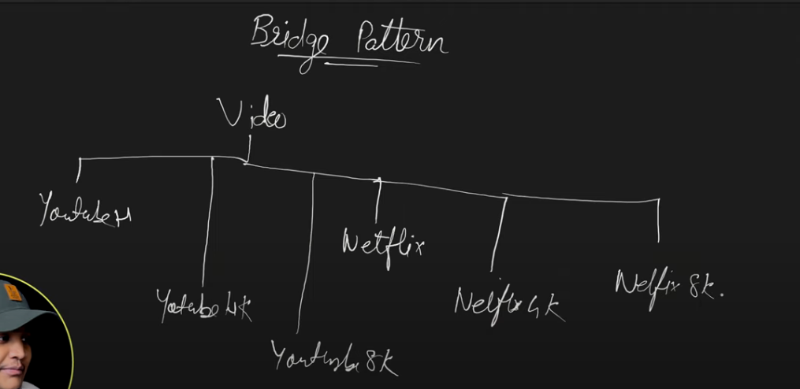

Aap Video ko youtube mein bhi dekh sakte ho aur netflix mein bhi. Usme bhi aap youtube aur netflix par video aap play kar sakte ho Hd, 4K, 8K ya HDMR mein..  

Yadi aapko ye functaionality hona you will create subclasses(subtype ) of that as well.

Aapko yadi PrimeVideo add karna hia... to usko bhi aap add karonge.. and uske subtypes ko bhi.. Jaise PrimeVideo Hd.. 4k etc 

So you creating the huge list of subclasses exponentially. This is not a good thing.

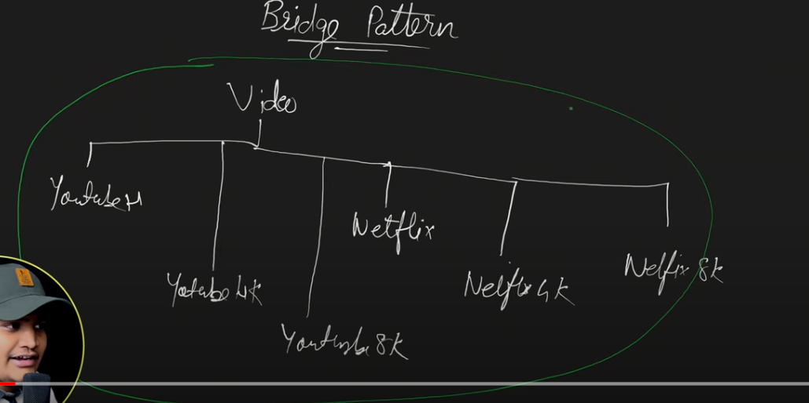
Bridge Pattern convert this entire relationship i.e Is-A relationship(Inheritance) into HAs-A relationship i.e composition.

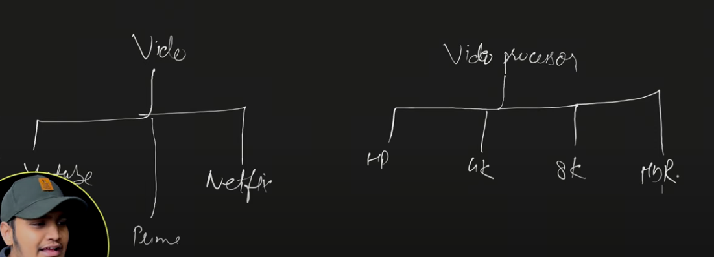
Hum separate hierarchy build karenge. Hum Processing class separate create karenge..

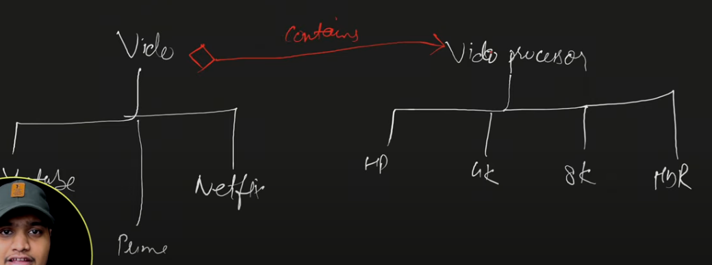
Now video (contain)will have videoProcessor. 
hum Youtube video se youtubeHd,youtube4k,youttuvbe8k ya youtubeHdmr bana sakte.. Same for the other video.

### VideoProcessor
```java
package com.adi.bridge.design.pattern;

//This is separate hierarchy :  let say = hierarchy-1
public interface VideoProcessor {

	void process(String videoFile);
}

```
### Implemented class
```java
package com.adi.bridge.design.pattern;

public class HDProcessor implements VideoProcessor{

	@Override
	public void process(String videoFile) {
		
		//process	
		System.out.println(" ==> "+videoFile);
	}

}
```

### Implemented class
```java
package com.adi.bridge.design.pattern;

public class UHD4KProcessor implements VideoProcessor{

	@Override
	public void process(String videoFile) {
		
		//process	
		System.out.println(" ==> "+videoFile);
	}
}
```

### Video
```java
package com.adi.bridge.design.pattern;

//This is separate hierarchy : let say- hierarchy-2
//With composition we can club multiple hierarchy.
//Video contain videoProcessor
// Video Has-A VideoProcessor
public abstract class Video {

	protected VideoProcessor processor;

	public Video(VideoProcessor processor) {
	
		this.processor = processor;
	}
	
	public abstract void play(String videoFile);
}
```
### Implemented class
```java
package com.adi.bridge.design.pattern;

public class YoutubeVideo extends Video{

	public YoutubeVideo(VideoProcessor processor) {
		
		super(processor);		
	}

	@Override
	public void play(String videoFile) {
		
		processor.process(videoFile);		
	}	
}
```

### Impelmented class
```java
package com.adi.bridge.design.pattern;

public class NetFlixVideo extends Video{

	public NetFlixVideo(VideoProcessor processor) {
		
		super(processor);		
	}

	@Override
	public void play(String videoFile) {
	
		processor.process(videoFile);
	}

}
```
### Main
```java
package com.adi.bridge.design.pattern;

public class MainBridge {

	public static void main(String[] args) {
		
		Video youtubeVideo = new YoutubeVideo(new HDProcessor());
		youtubeVideo.play("abc.mp4");
		
		Video netFlixVideo = new NetFlixVideo(new UHD4KProcessor());
	     netFlixVideo.play("xyz.mp4");	
	
	}
}
Output:
 ==> abc.mp4
 ==> xyz.mp4
```

We convert huge substantial classes library into two different hierarchy and converted into Has-A relationship.
# 8. Decorator Design Pattern

Part of Structural design pattern.

It will add behaviour of one object into special wrapper which will add another behviour of same object into it.

It is like box inside box inside box.

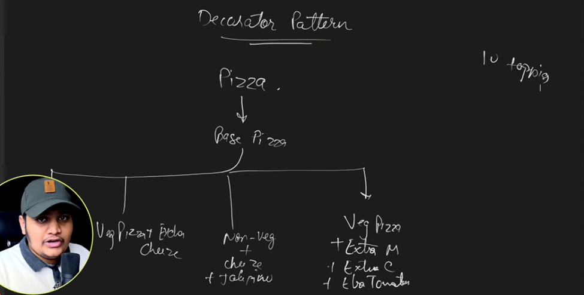

Har kisko base Pizza ke sath alag alag topping chaiye. 10 tarh ki toppings hai so bahut permutation combination ke pizza banege..

Ye requirement cater karne ke liye oops mein humko kayi saare classes banane padenge. 

Kyuki toppings add hone ke baad pizzaa ka structure change ho raha hai but ulitmately pizza hi hai.

so to save us decorator design pattern comes in picutre.

With Decorator design pattern.  
Yadi humko Pizza + jalepeno wala behaviour chaiye so hum pizaa+jalepeno behviour lelenge at end wo pizz hi honga with some extra toppings/behaviour.

### Rough Idea
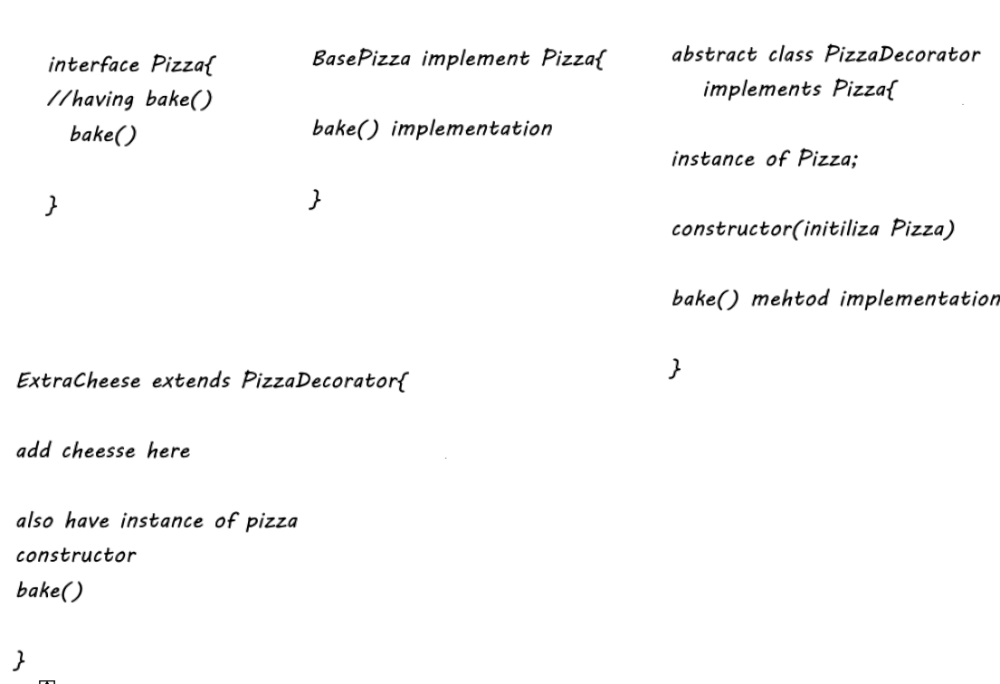

### Piza Interface
```java
package com.adi.decorator.designPattern;

public interface Pizza {

	//This Pizza interface having bake() 
	public String bake();
}
```

### Base Pizza
```java
package com.adi.decorator.designPattern;

//Implementation class

public class BasePizza implements Pizza{

	
	//Method returning Base Pizza
	
	@Override
	public String bake() {
		
		return "Base Pizza";
	}

}
```

### PizzaDecorator
```java
package com.adi.decorator.designPattern;

//abstract class of PizzaDecorator

public abstract class PizzaDecorator implements Pizza{

	//Instance of Pizza Interface
	protected Pizza pizza;
	
	//initialize this reference via constructor
	public PizzaDecorator(Pizza pizza) {
	
		this.pizza = pizza;
	}

	public String bake() {
		
		//returning the Pizza.bake()
		//base pizza return karwa raha hu.
		
		return pizza.bake();
	}
}
```

### CheeseDecorator
```java
package com.adi.decorator.designPattern;

//ChesseBurstDecorator

public class ChesseBurstDecorator extends PizzaDecorator {

	//Initialize Pizza via constructor
	
	public ChesseBurstDecorator(Pizza pizza) {
		super(pizza);	
	}
	 
	public String bake() {
		
		//Return base pizza + extra chesses behviour
		
		return pizza.bake() + addCheese();
	}

	public String addCheese() {
		
		return " + Cheese ";
	}

}
```

### JalpenoDecorator
```java
package com.adi.decorator.designPattern;

//JalpenoDecorator

public class JalepanoDecorator extends PizzaDecorator {

	//Initialize Pizza via constructor
	
	public JalepanoDecorator(Pizza pizza) {
		super(pizza);		
	}
	
	public String bake() {
		
		//Return base pizza + extra Jalpeno behviour
		return pizza.bake() + addJalepano();
	}

	public String addJalepano() {
		
		return " + Jalepano ";
	}

}
```

### How to call
```java
package com.adi.decorator.designPattern;

public class Main_Pizza_Decorator {

	public static void main(String[] args) {
		
		//I want pizza from Base
		// also i requirer cheese on that
		// on top of that i require Jalepano
		
		
		//Decorator on top of the basePizz
		// main Base se decorate karenge
		// add cheseburst on base Pizza
		// then also add Jalpeno
		
		Pizza pizza = new JalepanoDecorator(new ChesseBurstDecorator(new BasePizza()));

		System.out.println(pizza.bake());
	}

}
Output:
Base Pizza + Cheese  + Jalepano 
```
# 9. Facade Design Pattern

Part of Structural design pattern which allow us to structure our application.

Aap apne application mein 3rd party lib use kar rahe ho. That 3rd party lib is very huge.

Aapko 3rd party lib ki entire functionality nhi chaiye.. sirf thodi bahut hi functionality chaiye.

In that case you go for abstraction.

so aap ek helper class banate ho jo us 3rd party ko internally use karta hai.. and usme desired functionlity le lete ho. 

And instead of 3rd party aap wo helper class se desired functionlity late ho.

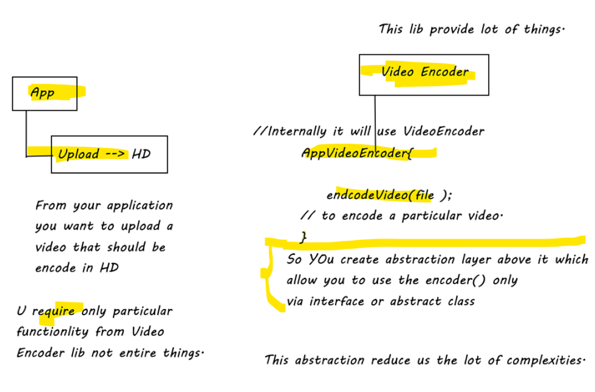

### 2nd eg
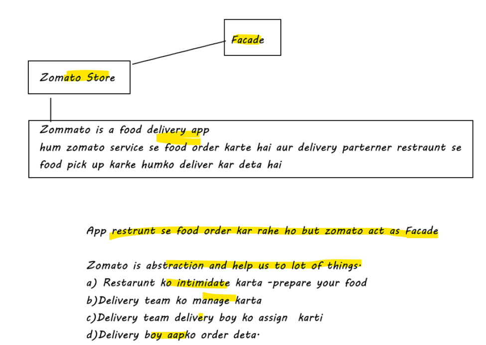

### Restraunt
```java
package com.adi.facade.designPattern;

//It is responsible to prepare my order
public class Restraunt {

	public void prepareOrder() {
		
	}
}
```
### DeliveryTeam
```java
package com.adi.facade.designPattern;

//It is responsible to assign a delivery boy.
public class DeliveryTeam {

	public void assignDeliveryBoy() {
		
	}
}
```

### DeliveryBoy
```java
package com.adi.facade.designPattern;

//Responsible to pick up the order from restraunt 
// and deliver it to the customer

public class DeliveryBoy {

	public void pickUpOrder() {
		
	}
	
	public void deliverOrder() {
		
	}
}
```

### ZomatoFacade
```java
package com.adi.facade.designPattern;

//DeliveryTeam - bahut sari delivery karti hia
//  hmko food delivery karne wali team chaiye

//deliveryBoy - bahut sare rahte 
//  humko food ko delivery karne wale bande cahiye..

//So basically ye abstraction provide kar raha hai sabka 
//  nhi toh ye sab kuch aapko manage karna padta tha..

// ZomatoFacade ke pass sari responsibility aa gyi 
//  it provide abstraction in top of everything
//    iske pass ek method hai which allow us to do all things

//Ye apne liye aasan ho gya to manage entire things
// i.e advantage of facade design pattern.. 
//  ye sab manage kar levenga..
public class ZomatoFacade {

	private Restraunt restraunt;
	
	private DeliveryTeam deliveryTeam;
	
	private DeliveryBoy deliveryBoy;
	
	public void placeOrder() {
		
		restraunt.prepareOrder();
		
		deliveryTeam.assignDeliveryBoy();
		
		deliveryBoy.pickUpOrder();
		
		deliveryBoy.deliverOrder();
	}
}
```

# 10. Proxy Design Pattern
Part of Structural design pattern

Allow us to create a proxy object or a reference object   to an actual object  
Which can we use easily …. Instead of an actual object.

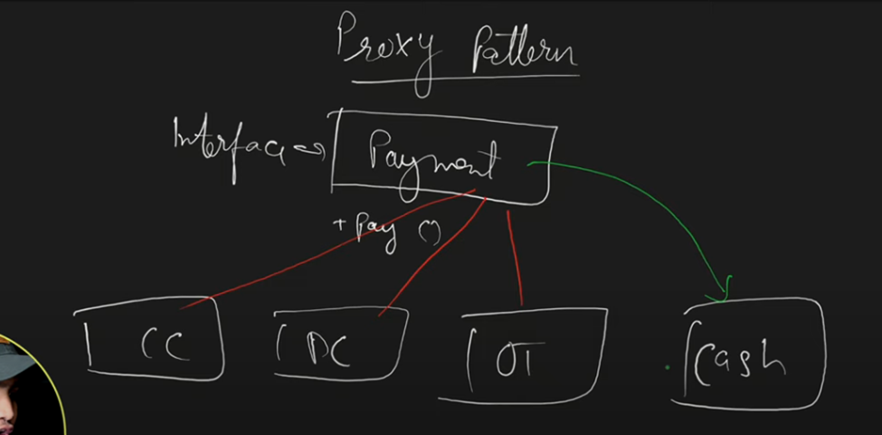
Aap kuch purchase karte ho to appko payment karna hota hia

In let’s take  Payment as an interface, In Payment(I) we have pay() method

Aap credit card ya debit card ya Online transaction ya cash se  bhi shopkeeper  ko pay kar sakte ho and at end sab cash hi hai. 

Here Cash is acutal object

So CC/DC/OT are proxy to cash

### 2nd Eg
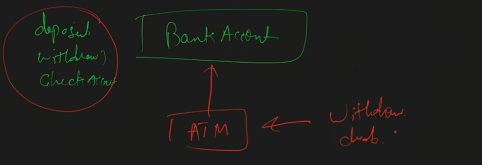

Aap apne bank mein jake bankAccount aap kayi sare operation kar sakte ho like withdraw/deposit/check balance

Aap same kam ATM jakar bhi kar sakte ho. So ATM is like proxy to your bank Account

### Account
```java
package com.adi.proxy.designPattern;

//we have account interface
public interface Account {

	//contianing two methods
	
	public void withdraw();
	
	void getAccountNumber();
}
```

### BankAccount
```java
package com.adi.proxy.designPattern;

//The Account interface is implemented by the BankAccount

public class BankAccount implements Account {

	@Override
	public void withdraw() {
		
		System.out.println("Amount withdraw from Bank Account");
	}

	@Override
	public void getAccountNumber() {
		
		System.out.println("Your account number is XYZ");
	}

}
```
### ATM
```java
package com.adi.proxy.designPattern;

//This is proxy object i.e proxy to BankAccount
//  it should also implement Account
//   it contain object of Acutal object i.e bankAccount

public class ATM implements Account{

	@Override
	public void withdraw() {
		
		//Access withdraw() method using BankAccount 
		//So u use proxy but actually interanlly it is using actual object
		
		
		BankAccount bankAccount = new BankAccount();		
		bankAccount.withdraw();
		
		System.out.println("Via ATM");
	}

	@Override
	public void getAccountNumber() {		
		
	}

}
```
### main
```java
package com.adi.proxy.designPattern;

public class Main_Proxy {

	public static void main(String[] args) {
		
		ATM atm = new ATM();
		
		atm.withdraw();
	}

}
Output:
Amount withdraw from Bank Account
Via ATM

```
# 11. Composite Design Pattern


# 16. Observer Design Pattern
Part of behavioral design pattern 

Also called as Publisher-subscriber design pattern or  
Observable – observer design pattern.

If there is change in state of publisher object then the subscriber will get notify.

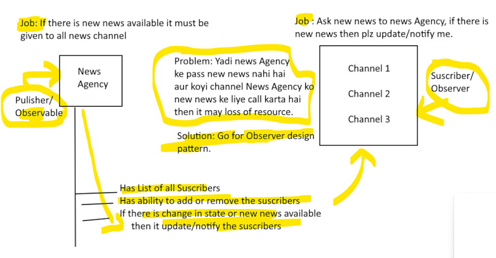

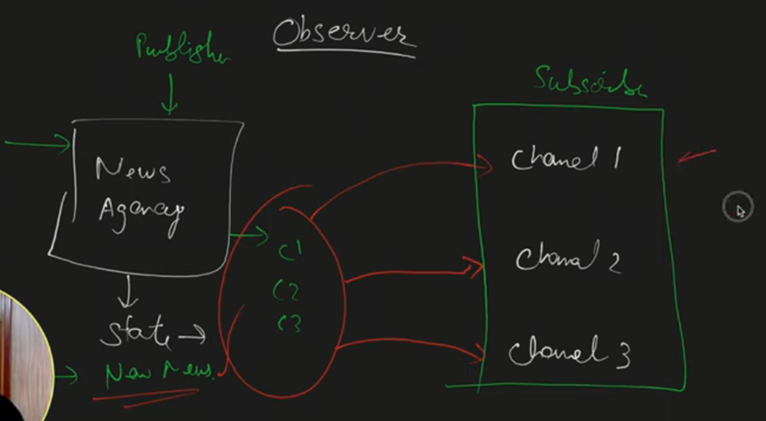

### Channel
```java
package com.adi.observer.designPattern;

//Suscriber has update() method

public interface Channel {

	public void update(Object o);
}
```

### NewsChannel
```java
package com.adi.observer.designPattern;

public class NewsChannel implements Channel {

	private String news;
	
	public String getNews() {
		return news;
	}

	public void setNews(String news) {
		this.news = news;
	}

	@Override
	public void update(Object news) {
		
		this.setNews((String) news);
	}

}
```

### NewsAgency
```java
package com.adi.observer.designPattern;

import java.util.ArrayList;
import java.util.List;

//Publisher

public class NewsAgency {

	//Has news and that news to be pulished to diff suscriber.
	private String news;
	
	//NewsAgecy contain all list of suscribers
	private List<Channel> channels = new ArrayList();
	
	//ablity to add New suscriber
	public void addObserver(Channel channel) {
		
		this.channels.add(channel);
	}
	
	//ability to remove suscriber
	public void removeObserver(Channel channel) {
		
		this.channels.remove(channel);
	}
	
	//When there is change of state or new news available.
	public void setNews(String news) {
		
		//it will set the news first
		this.news = news;
		
		//update all channels
		for(Channel channel : this.channels) {
			
			channel.update(this.news);
		}
	}
}
```

### Main
```java
package com.adi.observer.designPattern;

public class Main_Observer {

	public static void main(String[] args) {
		
		NewsChannel channel1 = new NewsChannel();
		
		NewsAgency newsAgency = new NewsAgency();
		
		newsAgency.addObserver(channel1);
		
		newsAgency.setNews("Russia vs Ukrain war happening");
		
		System.out.println(channel1.getNews());
	}

}
Output:
Russia vs Ukrain war happening

```
# 17. Flyweight Design Pattern
Also called as Cache Design Pattern

When to use Flyweight Design Pattern?
-	Number of Object creation is huge 
-	Object creation is very heavy in processing (i.e taking too much time  for creating the object in memory.)
-	Object has intrinsic(object is unique) and extrinsic (added by the client) properties

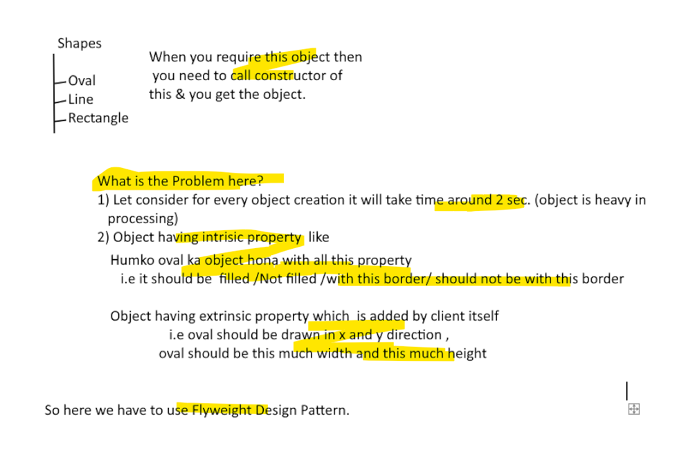
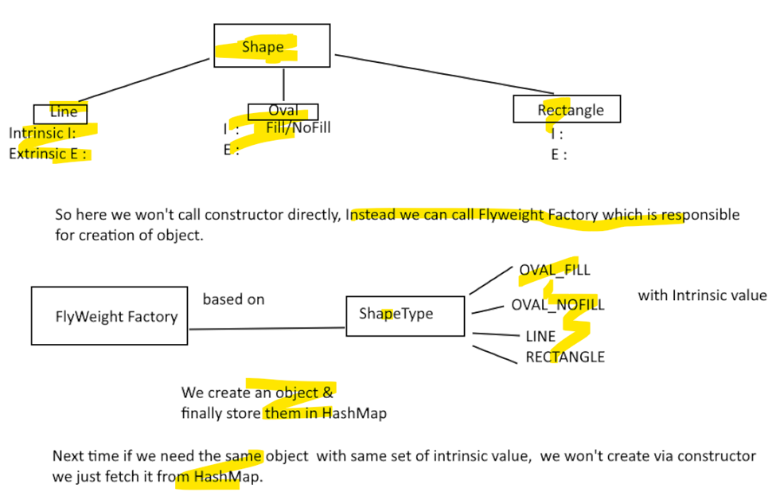

### Shape
```java
package com.adi.flyweight.designPattern;


import java.awt.*;


public interface Shape {

	
	public void draw(Graphics g,int x, int y, int width, int height,
			Color color);
	
}
```
### Line
```java
package com.adi.flyweight.designPattern;

import java.awt.Color;
import java.awt.Graphics;

//Implementation class having intrinsic and extrinsic property
public class Line implements Shape {

	public Line() {
		
		System.out.println("Creating Line Object");
		
		//Here we provide delay.
		try {
			Thread.sleep(2000);
			
		} catch (InterruptedException e) {
			
			e.printStackTrace();
		}
	}
	
	@Override
	public void draw(Graphics line, int x1, int y1, int x2, int y2, Color color) {
		
		line.setColor(color);
		line.drawLine(x1, y1, x2, y2);
		
	}

}
```
### Oval
```java
package com.adi.flyweight.designPattern;

import java.awt.Color;
import java.awt.Graphics;

public class Oval implements Shape {

	//Provide intrinsic property
	private boolean fill;

	public Oval(boolean f) throws InterruptedException {

		this.fill = f;
		System.out.println("Creating an Oval object with fill=" + f);

		// Provide delay
		Thread.sleep(2000);

	}

	@Override
	public void draw(Graphics circle, int x, int y, int width, int height, Color color) {

		circle.setColor(color);
		circle.fillOval(x, y, width, height);
	}

}
```
### ShapeType
```java
package com.adi.flyweight.designPattern;

public enum ShapeType {

	OVAL_FILL,OVAL_NOFILL,LINE;
}
```

### ShapeFactory
```java
package com.adi.flyweight.designPattern;

import java.util.HashMap;

public class ShapeFactory {

	private static final HashMap<ShapeType, Shape> shapes = new HashMap<>();
	
	//Based on shapetype we provide instance 
	// if instance is not avialable for first time
   // then we create that and put in HashMap
	// next time we direclty fetch from it.
	public static Shape getShape(ShapeType type) throws InterruptedException {
		
		Shape shapeImpl = shapes.get(type);
		
		if(shapeImpl == null) {
			
			if(type.equals(ShapeType.OVAL_FILL)) {
				
				shapeImpl = new Oval(true);
			}
			else if(type.equals(ShapeType.OVAL_NOFILL)) {
				
				shapeImpl = new Oval(false);
			}
			else if(type.equals(ShapeType.LINE)) {
				
				shapeImpl = new Line();
			}
			
			shapes.put(type, shapeImpl);
		}
		
		return shapeImpl;
	}
}
```
### Client
```java
package com.adi.flyweight.designPattern;

import java.awt.BorderLayout;
import java.awt.Color;
import java.awt.Container;
import javax.swing.JButton;
import javax.swing.JFrame;
import javax.swing.JPanel;

import java.awt.Graphics;
import java.awt.event.ActionEvent;
import java.awt.event.ActionListener;

public class DrawingClient extends JFrame{
	
	private static final long serialVersionUID = -1350200437285282550L;
	private final int WIDTH;
	private final int HEIGHT;
	
	private static final ShapeType shapes[] = { ShapeType.LINE, ShapeType.OVAL_FILL,ShapeType.OVAL_NOFILL };
	private static final Color colors[] = { Color.RED, Color.GREEN, Color.YELLOW };
	
	public DrawingClient(int width, int height){
		this.WIDTH=width;
		this.HEIGHT=height;
		Container contentPane = getContentPane();

		JButton startButton = new JButton("Draw");
		final JPanel panel = new JPanel();

		contentPane.add(panel, BorderLayout.CENTER);
		contentPane.add(startButton, BorderLayout.SOUTH);
		setSize(WIDTH, HEIGHT);
		setDefaultCloseOperation(JFrame.EXIT_ON_CLOSE);
		setVisible(true);

		startButton.addActionListener(new ActionListener() {
			public void actionPerformed(ActionEvent event) {
				Graphics g = panel.getGraphics();
				for (int i = 0; i < 20; ++i) {
					Shape shape = null;
					try {
						shape = ShapeFactory.getShape(getRandomShape());
					} catch (InterruptedException e) {
						// TODO Auto-generated catch block
						e.printStackTrace();
					}
					shape.draw(g, getRandomX(), getRandomY(), getRandomWidth(),
							getRandomHeight(), getRandomColor());
				}
			}
		});
	}
	private ShapeType getRandomShape() {
		return shapes[(int) (Math.random() * shapes.length)];
	}

	private int getRandomX() {
		return (int) (Math.random() * WIDTH);
	}

	private int getRandomY() {
		return (int) (Math.random() * HEIGHT);
	}

	private int getRandomWidth() {
		return (int) (Math.random() * (WIDTH / 10));
	}

	private int getRandomHeight() {
		return (int) (Math.random() * (HEIGHT / 10));
	}

	private Color getRandomColor() {
		return colors[(int) (Math.random() * colors.length)];
	}

	public static void main(String[] args) {
		DrawingClient drawing = new DrawingClient(500,600);
	}
}
```


